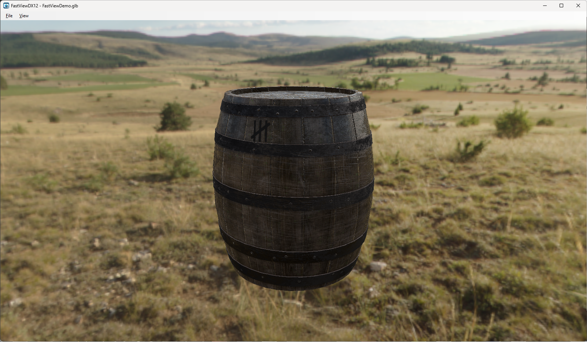

# FastView

FastView is a lightweight Windows viewer and scene-assembly tool for **GLB** and **glTF** files. It uses WinForms and Direct3D 12, focuses on static-model workflows, and includes Windows Explorer thumbnail providers.



## Download

**[Download the latest FastView installer](https://github.com/DINmatin/FastViewDX12/releases/latest/download/FastView_Setup_1.2.0.exe)**

Download the installer, start `FastView_Setup_1.2.0.exe`, and follow the setup instructions.

After installation, GLB and glTF files can be opened with FastView and displayed as thumbnails in Windows Explorer.

## Current features

### Viewing and scene assembly

- Open `.glb` and `.gltf` files from the command line, drag-and-drop, **Open with**, or the File menu.
- Add multiple models to one scene without replacing the models already loaded.
- Select models directly in the viewport or from the scene sidebar.
- Focus the selected model with `F`; when nothing is selected, `F` fits the complete scene.
- Perspective camera presets for front, right, left, top, bottom, and back views.
- Optional adaptive XZ ground grid at the world origin.
- Persistent viewer settings, including camera view, background, grid, lighting, active transform tool, and Local/Global orientation.

### Transform tools

- Unity-style shortcuts:
  - `W` — Move
  - `E` — Rotate
  - `R` — Scale
- Local and Global transform orientations.
- Axis scale handles plus a central uniform-scale handle.
- Per-row reset buttons for Position, Rotation, and Scale, plus a full Transform reset.
- Hold `Shift` while rotating the camera or a model to snap to 90-degree steps.
- `Ctrl+Z` transform undo with one undo step per completed gizmo drag.
- Collapsible viewport toolbar with transform, orientation, view, shadow, and bloom controls.

### Rendering

- Direct3D 12 rendering with PBR-style material support.
- Solid-color, built-in EXR, or user-selected EXR backgrounds.
- EXR environment lighting and adjustable background opacity.
- Directional-light shadows with adjustable strength and softness.
- Bloom with adjustable threshold, intensity, and radius.
- Support for emissive values above 1 through `KHR_materials_emissive_strength`.
- Support for `TEXCOORD_1`, `KHR_texture_transform`, texture wrap modes, double-sided materials, alpha modes, unlit materials, and thin-surface transmission.

### Export

- Export the assembled multi-model scene as a self-contained `.glb` file.
- Current model transformations are included in the exported geometry.
- Viewer-only helpers and effects such as the grid, gizmos, camera, background, bloom, and shadows are not exported.

### Windows Explorer integration

- Transparent Explorer thumbnails with automatic crop and a tighter model fit.
- 45-degree three-quarter thumbnail camera view.
- `.glb` thumbnail support through a stream-based provider.
- `.gltf` thumbnail support, including adjacent `.bin` and texture files, through a file-based provider.
- Multi-resolution GLB/glTF fallback icon from 16 to 256 px.
- Inno Setup installer build.

## Keyboard shortcuts

| Shortcut | Action |
| --- | --- |
| `W` | Move tool |
| `E` | Rotate tool |
| `R` | Scale tool |
| `L` | Toggle Local/Global orientation |
| `F` | Focus selection, or fit the complete scene |
| `G` | Toggle ground grid |
| `Ctrl+Z` | Undo last transform |
| `Shift` while rotating | Snap to 90-degree steps |

## Requirements

### End users

- Windows 10 or newer, x64
- Microsoft .NET 10 Runtime (x64) for the Windows Explorer thumbnail provider

The viewer is published self-contained. The COM thumbnail provider remains framework-dependent because .NET COM hosting does not support self-contained deployment. The installer checks for the x64 .NET 10 runtime before installing.

### Developers

- Visual Studio 2022 with the .NET desktop development workload, or the .NET 10 SDK
- Inno Setup 6.3 or newer for installer builds

NuGet restore supplies the DirectX Shader Compiler used to compile the HLSL files during the build. Generated `.cso` files are intentionally not stored in Git.

## Build

Open `FastView.slnx` in Visual Studio and build the solution, or run:

```powershell
dotnet build .\FastView.slnx -c Release
```

Create a self-contained release payload and ZIP:

```powershell
powershell -ExecutionPolicy Bypass -File .\build\BuildRelease.ps1 -Version 1.2.0
```

Create the Windows installer:

```text
installer\BuildInstaller.cmd
```

The build scripts use only repository-relative paths. Output is written to `artifacts/` and `installer/Output/`.

## Thumbnail-provider architecture

`.glb` files are self-contained, so their provider uses `IInitializeWithStream` and writes the supplied stream to a temporary GLB.

`.gltf` files may reference neighboring `.bin`, `.png`, `.jpg`, or other files. Their provider therefore uses `IInitializeWithFile` and passes the original file path to FastView. The installer registers a separate CLSID for this provider.

## Manual thumbnail test

```bat
FastViewDX12.exe --thumbnail "C:\path\model.glb" "C:\Temp\FastViewTest.png" 768 768
```

The output PNG should contain the model on a transparent background.

## Repository layout

```text
src/FastViewDX12/                 Viewer and thumbnail renderer
src/FastView.ThumbnailProvider/   Explorer COM thumbnail providers
build/                            Reproducible release scripts
installer/                        Inno Setup project
docs/                             Testing and release notes
```

## Free sample model

A free GLB model is included for testing FastViewDX12:

[Download FastViewDemo.glb](samples/FastViewDemo.glb)

The sample model is released under CC0 1.0. See
[`samples/README.md`](samples/README.md) for details.

### License

FastViewDX12 and its source code are licensed under the
[MIT License](LICENSE).

The sample model in `samples/` is released separately under the
Creative Commons CC0 1.0 Universal Public Domain Dedication.

Third-party assets and package information are listed in
[THIRD_PARTY_NOTICES.md](THIRD_PARTY_NOTICES.md).

## Developer documentation

- [Architecture and ownership](docs/ARCHITECTURE.md)
- [Refactor notes and validation](docs/REFACTOR_NOTES.md)
- [Testing](docs/TESTING.md)
- [Release checklist](docs/RELEASE_CHECKLIST.md)
